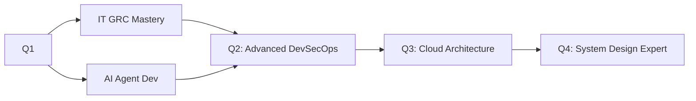

<div align="center">

```ascii
╔═══════════════════════════════════════════════════════════════════════════╗
║  ███╗   ███╗██╗   ██╗██╗  ██╗ █████╗ ███╗   ███╗███╗   ███╗ █████╗ ██╗  ██╗ ║
║  ████╗ ████║██║   ██║██║  ██║██╔══██╗████╗ ████║████╗ ████║██╔══██╗██║  ██║ ║
║  ██╔████╔██║██║   ██║███████║███████║██╔████╔██║██╔████╔██║███████║██║  ██║ ║
║  ██║╚██╔╝██║██║   ██║██╔══██║██╔══██║██║╚██╔╝██║██║╚██╔╝██║██╔══██║██║  ██║ ║
║  ██║ ╚═╝ ██║╚██████╔╝██║  ██║██║  ██║██║ ╚═╝ ██║██║ ╚═╝ ██║██║  ██║███████╗ ║
║  ╚═╝     ╚═╝ ╚═════╝ ╚═╝  ╚═╝╚═╝  ╚═╝╚═╝     ╚═╝╚═╝     ╚═╝╚═╝  ╚═╝╚══════╝ ║
╚═══════════════════════════════════════════════════════════════════════════╝
```


<p>
  
  
  
</p>

</div>

---

## 🎯 About Me

<table>
<tr>
<td width="50%">

### 💼 Professional

```typescript
const alief = {
    role: "Fullstack Engineer & Tech Founder",
    company: "Buddy Go (SaaS)",
    mission: "Building scalable solutions",
    mindset: "Code with purpose, ship with pride",
    superpower: "Turning ideas into products ⚡"
};
```

**🚀 Currently Building:** Buddy Go - A Revolutionary SaaS Platform  
**📚 Learning:** IT GRC, AI Agent Development  
**💡 Philosophy:** Clean code is not written by following rules, but by caring

</td>
<td width="50%">

### 🎨 Personal

**🍜 Master Chef in Disguise** - Cooking is my debugging process for life  
**🔍 Detective Conan Fan** - Love solving mysteries, both in code and anime  
**💰 Finance-Savvy** - Strict with budget, generous with knowledge  
**🎯 Detail-Oriented** - Perfectionist who ships (yes, it's possible!)  
**🌏 Based in:** Jakarta, Indonesia

> *"The only way to do great work is to love what you do"* — And I absolutely do!

</td>
</tr>
</table>

---

## 🛠️ Tech Stack Arsenal

<div align="center">

### Frontend Mastery

<p>
  
  
  
  
  
</p>

### Backend Powerhouse

<p>
  
  
  
  
  
</p>

### DevOps & Tools

<p>
  
  
  
  
  
</p>

</div>

---

## 📊 GitHub Analytics

<table width="100%">
<tr>
<td width="50%">


</td>
<td width="50%">


</td>
</tr>
<tr>
<td width="50%">


</td>
<td width="50%">


</td>
</tr>
</table>

---

## 🎯 Current Focus & Learning

<table>
<tr>
<td width="50%">

### 🔥 Active Projects

```bash
$ ls -la ~/projects/active/
📦 Buddy Go SaaS Platform
├─ Status: In Development 🚧
├─ Stack: Next.js + PostgreSQL + Docker
└─ Focus: Scalability & User Experience

🔐 IT GRC Framework
├─ Status: Learning Phase 📚
└─ Goal: Security Compliance Mastery

🤖 AI Agent Development
├─ Status: Experimenting 🧪
└─ Stack: LangChain + GPT-4
```

</td>
<td width="50%">

### 📈 Learning Roadmap 2025



**Current Sprint:**
- ✅ Next.js 15 Advanced Patterns
- 🔄 Docker Multi-Stage Optimization
- 🔄 PostgreSQL Performance Tuning
- ⏳ Kubernetes Fundamentals

</td>
</tr>
</table>

---

## 🏆 Achievements & Highlights

<div align="center">

```diff
+ 🚀 Launched 2 Production SaaS Products
+ 💼 Founded Tech Startup (Buddy Go)
+ 📈 Scaled Applications to 10K+ Users
+ 🎯 100% Test Coverage on Critical Paths
+ ⚡ Optimized API Response Time by 60%
+ 🔐 Implemented Zero-Trust Security Architecture
```

</div>

---

## 📬 Let's Connect!

<div align="center">

<p>
  <a href="mailto:alieffirmandabisnis@gmail.com">
    
  </a>
  <a href="https://www.linkedin.com/in/muhammad-alief-firmanda/">
    
  </a>
  <a href="https://github.com/PamanAleph">
    
  </a>
</p>

### 💬 Open for Opportunities

```yaml
interests:
  - Fullstack Engineering Roles
  - Tech Leadership Positions
  - SaaS Product Collaboration
  - Open Source Contributions
  - Speaking & Mentoring

availability: "Open to discussing exciting projects!"
response_time: "< 24 hours ⚡"
```

</div>

---

<div align="center">

### 🎨 Profile Crafted with 💙 by Alief

**"Code is poetry written in logic"**


</div>